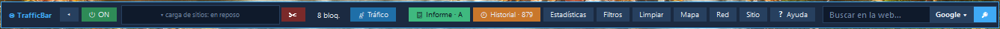
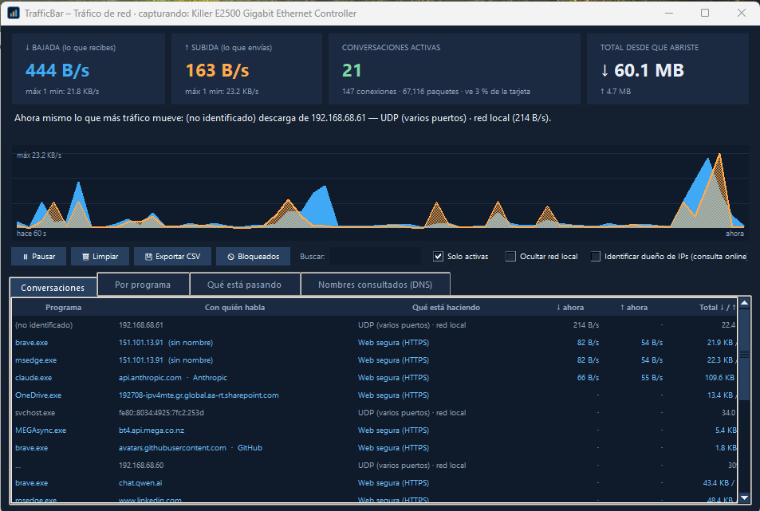
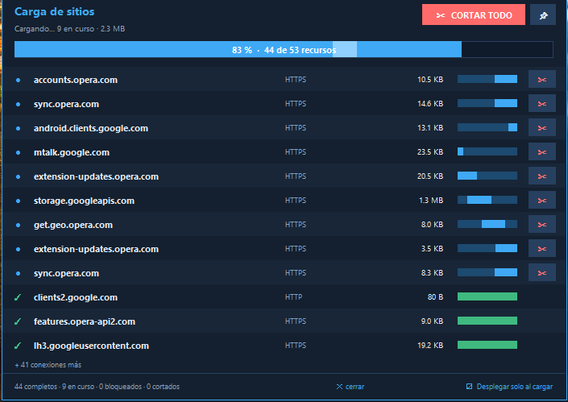
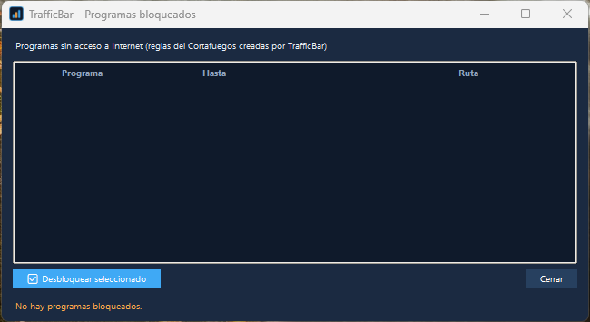

# TrafficBar

*(Antes NavTool — renombrado en la 1.0.0 para evitar coincidir con el nombre de una empresa sin relación. Misma app, misma licencia, mismo autor.)*

**Una barra flotante para Windows que te muestra y controla lo que pasa con tu conexión a Internet**:
cómo cargan las páginas, quién te rastrea y qué programas usan tu red. Funciona con todos los navegadores.

*(English: [README.md](README.md))*



## Capturas

**Monitor de red** — cada programa, con quién habla y cuánto mueve, con totales exactos (captura con Npcap).



<table>
<tr>
<td width="50%" valign="top"><b>Panel de carga de sitios</b> — mira cada conexión mientras carga una página y corta la que quieras.<br><br></td>
<td width="50%" valign="top"><b>Programas bloqueados</b> — programas sin acceso a Internet mediante reglas del Cortafuegos, y hasta cuándo.<br><br></td>
</tr>
</table>

## Qué hace

| | |
|---|---|
| **Barra de carga** | Ve cada conexión de una página mientras carga y **córtala** con un clic (pop-ups, cargas en cadena). |
| **Informe de privacidad** | Una nota (A–F) por página: qué rastreadores contactó y cuáles bloqueó TrafficBar. |
| **Listas de bloqueo** | Lista incluida, listas opcionales (Peter Lowe / StevenBlack), lista personal y excepciones. |
| **Monitor de red** | Cada programa, con quién habla, cuánto mueve. Captura con Npcap, totales exactos. |
| **Bloquear un programa** | Clic derecho en el monitor → reglas del Cortafuegos de Windows (1 h / 4 h / hasta desbloquear). |
| **Apps de la Tienda** | WhatsApp, Microsoft Store y otras apps de la Tienda funcionan con el proxy encendido (exención de loopback de Windows, con un clic). |
| **Detector de telemetría** | Avisa cuando un programa de tu PC contacta con un servidor de telemetría/diagnóstico conocido (fallos, estadísticas de uso). Lo registra en su propio historial — nunca lo bloquea. |
| **Cuota mensual** | Define tu plan y el día de corte: consumo, proyección y avisos al 80 % / 100 %. |
| **Historial y alertas** | Consumo por minuto y por programa, programas nuevos, subidas sostenidas. Solo en tu PC. |
| **Buscador** | Hasta 5 motores, una tecla para buscar en todos. |
| **Idiomas** | Inglés (por defecto) y español incluidos; carga más packs de idioma (`.json`). |
| **Barra** | Grande / mediana / contraída, imán en los bordes, icono en la bandeja, tooltips, multipantalla. |

Todo se ejecuta en tu equipo. **Sin telemetría, sin cuentas, sin actualizaciones automáticas.**

## Firma de código

Las versiones actuales **no están firmadas digitalmente**; Windows SmartScreen puede mostrar un aviso. Comprueba la integridad
de la descarga con el SHA-256 publicado en las notas de cada versión:

```powershell
Get-FileHash .\TrafficBar-Setup-<versión>.exe -Algorithm SHA256
```

Ver [CODE_SIGNING_POLICY.md](CODE_SIGNING_POLICY.md) y la [política de privacidad](PRIVACY.md).

## Instalación

Descarga desde la página de [Releases](../../releases):

* `TrafficBar-Setup-<versión>.exe` — instalador (inglés por defecto; español en la primera pantalla).
* `TrafficBar-Portable-<versión>.zip` — portable, no deja rastro en el PC.

Comprueba el SHA-256 de las notas de la versión. Los ejecutables **no están firmados**: SmartScreen puede avisar («Más información» → «Ejecutar de todas formas»).

**Requisitos:** Windows 10 u 11, de 64 bits. Windows 7, 8 y 8.1 **no son compatibles** (el runtime de Python sobre el que se
construye TrafficBar no funciona en ellos; en Windows 7 verías «falta api-ms-win-core-path-l1-1-0.dll»).

El monitor de tráfico necesita [Npcap](https://npcap.com) y permisos de administrador. TrafficBar no incluye Npcap (su licencia prohíbe redistribuirlo): si falta, **el instalador te ofrece descargarlo de npcap.com** (comprobando su SHA-256) y abre el instalador del propio Npcap, donde aceptas su licencia. Puedes decir que no: todo salvo el monitor de tráfico funciona sin él.

## Ejecutar desde el código

```powershell
python -m pip install -r requirements.txt
python trafficbar.py
```

Compilar instalador y zip portable (necesita [Inno Setup 6](https://jrsoftware.org/isinfo.php)):

```powershell
powershell -ExecutionPolicy Bypass -File .\compilar.ps1
```

## Pruebas

```powershell
python pruebas_seguridad.py    # 52 pruebas de ataque y regresión
python pruebas_funciones.py    # cuota, bloqueo de programas, apps de la Tienda, idiomas, créditos
```

Más: [SEGURIDAD.md](SEGURIDAD.md) · [MEDICION.md](MEDICION.md) · [TRADUCIR.md](TRADUCIR.md) · [CHANGELOG.md](CHANGELOG.md) · [LICENCIAS-TERCEROS.md](LICENCIAS-TERCEROS.md)

## Licencia

Copyright (C) 2026 Fernando Erazo. TrafficBar es software libre: puedes redistribuirlo y modificarlo según los
términos de la **Licencia Pública General de GNU versión 3** (ver [LICENSE](LICENSE)). Se distribuye con la esperanza de que sea
útil, pero **sin ninguna garantía**.

## Créditos

Diseño y dirección: Fernando Erazo ([@xev777](https://github.com/xev777)). Desarrollo con asistencia de Claude (Anthropic).
Componentes de terceros: Npcap (lo instala el usuario), psutil, Python/Tkinter. Ver [LICENCIAS-TERCEROS.md](LICENCIAS-TERCEROS.md).

## Apoyar el proyecto

TrafficBar es gratuito y lo seguirá siendo. Si te resulta útil, puedes apoyar su desarrollo por PayPal
(xev667@hotmail.com) — totalmente opcional, y también disponible desde el «Acerca de» de la app.
